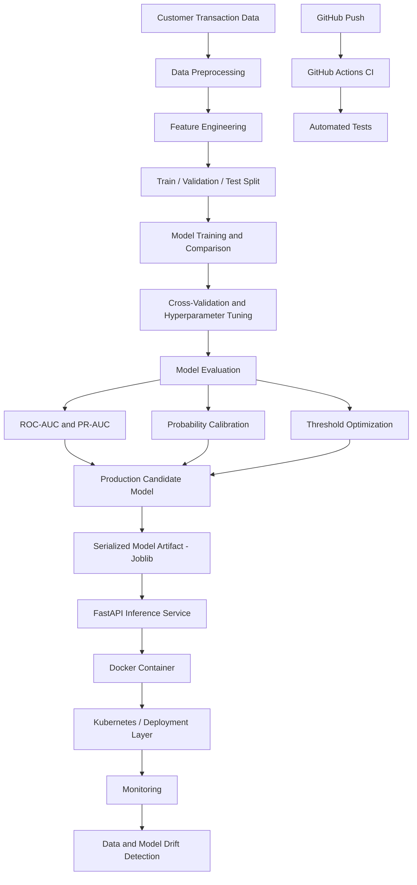
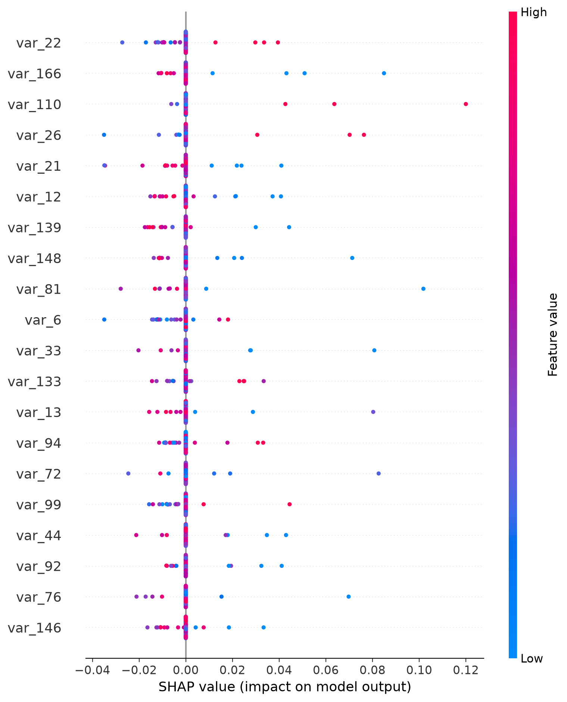
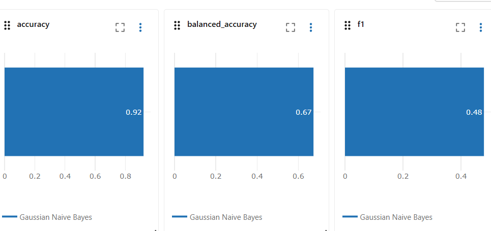
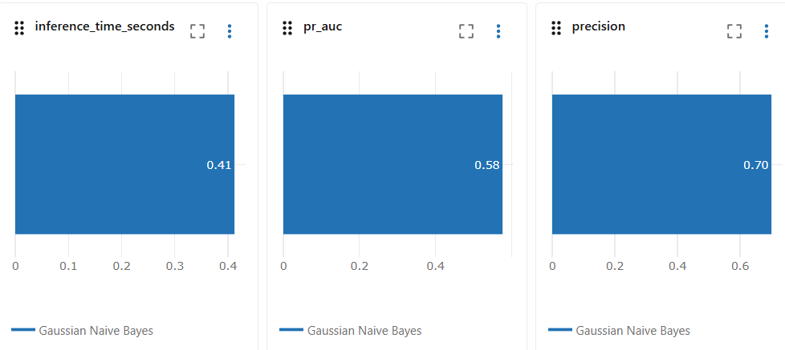
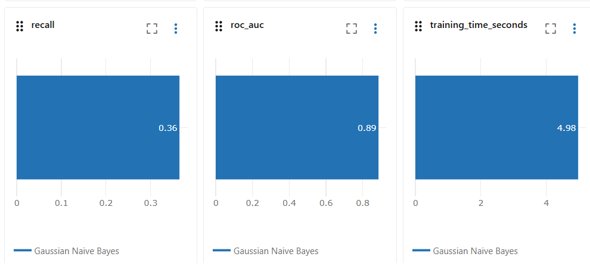

# Customer Transaction Prediction - End-to-End MLOps
[](https://github.com/rc-mathew/Customer_Transaction_Prediction_MLOps/actions/workflows/ci.yml)

An end-to-end machine learning project for customer transaction prediction,
covering model development, evaluation, probability calibration, explainability,
FastAPI serving, Docker containerization, local Kubernetes deployment,
automated testing, GitHub Actions CI, subgroup stability analysis, and
production drift monitoring.

## Implemented MLOps Components

- Data preprocessing and feature engineering
- Model training and evaluation
- ROC-AUC and classification metrics
- Probability calibration
- Subgroup stability analysis
- REST API deployment
- Automated testing
- Docker containerization
- Continuous Integration with GitHub Actions
- Docker image build and CI validation
- Kubernetes deployment
- Data and model drift monitoring


## System Architecture

The project follows an end-to-end MLOps workflow from raw customer transaction data through model development, deployment, continous integration, and production monitoring.



### Architecture Coverage

- **Data layer:** preprocessing, feature engineering, and stratified dataset splitting
- **Model layer:** training, comparison, cross-validation, tuning, and evaluation
- **Decision layer:** probability calibration and decision-threshold optimization
- **Serving layer:** serialized model served through FastAPI
- **Containerization:** Docker-based application packaging
- **Deployment:** Kubernetes-ready deployment structure
- **CI/CD:** automated testing through GitHub Actions
- **Monitoring:** data and model drift detection
## Model Evaluation Results

The production ML pipeline was evaluated using stratified validation, probability calibration, and decision-threshold optimization.
## REST API Deployment

The trained production ML pipeline is exposed through a FastAPI inference service for real-time customer transaction predictions. 

## Kubernetes Production Deployment
## AWS ECR + Amazon EKS Production Deployment

The FastAPI inference service was containerized with Docker and validated through a complete AWS-hosted Kubernetes deployment.

### Production Deployment Flow

```text
Trained ML Model
      ↓
FastAPI Inference API
      ↓
Docker Image
      ↓
Amazon Elastic Container Registry (ECR)
      ↓
Amazon Elastic Kubernetes Service (EKS)
      ↓
Kubernetes Deployment
      ↓
Kubernetes Service / AWS Load Balancer
      ↓
Live /predict Request
      ↓
Prediction Response
```

### API Endpoints

- `GET /` — API information
- `GET /health` — model health check
- `POST /predict` — customer transaction prediction

The API loads the serialized production model from:

```text
models/customer_transaction_model.joblib
```
### Decision Threshold Optimization

A fixed classification threshold of 0.50 is not necessarily optimal for an imbalanced classification problem. The decision threshold was therefore optimized on the validation data by maximizing the F1 score.

The selected threshold was:

**0.26**

Validation performance at the selected threshold:

| Metric | Score |
|---|---:|
| Precision | 0.511 |
| Recall | 0.560 |
| F1 Score | 0.534 |
| Balanced Accuracy | 0.750 |

### Validation Results

| Model | Accuracy | Balanced Accuracy | Precision | Recall | F1 | ROC-AUC | PR-AUC |
|---|---:|---:|---:|---:|---:|---:|---:|
| **Gaussian Naive Bayes** | **0.9204** | 0.6735 | 0.7000 | 0.3645 | **0.4794** | **0.8864** | **0.5764** |
| HistGradientBoosting | 0.9103 | 0.5630 | **0.8571** | 0.1284 | 0.2233 | 0.8776 | 0.5462 |
| Logistic Regression | 0.7759 | **0.7743** | 0.2783 | **0.7723** | 0.4092 | 0.8543 | 0.4932 |
| Random Forest | 0.8995 | 0.5000 | 0.0000 | 0.0000 | 0.0000 | 0.8176 | 0.3637 |

### Champion Model Selection

Gaussian Naive Bayes was selected as the champion based primarily on ranking performance for the imbalanced classification problem. It achieved the highest ROC-AUC (**0.8864**) and PR-AUC (**0.5764**) among the evaluated models.

The benchmark also exposed important operating trade-offs:

- **Logistic Regression** achieved the highest recall (0.7723) and balanced accuracy (0.7743), but substantially lower precision (0.2783).
- **HistGradientBoosting** achieved the highest precision (0.8571), but recall fell to only 0.1284.
- **Random Forest** produced no positive predictions at the evaluated threshold, resulting in zero precision, recall, and F1 despite relatively high overall accuracy.
- **Gaussian Naive Bayes** provided the strongest ROC-AUC and PR-AUC while maintaining a more useful precision-recall trade-off than the other benchmarked models.

The results demonstrate why accuracy alone is inappropriate for this imbalanced dataset. Model selection therefore emphasizes ROC-AUC and PR-AUC alongside precision, recall, F1, and balanced accuracy.

The champion's operating threshold is subsequently optimized on validation data rather than relying on the default 0.50 classification threshold.


## Model Performance

The final production-candidate model was selected based on hold-out performance, with particular emphasis on ROC-AUC and PR-AUC because the target variable is imbalanced.

## Model Explainability — SHAP

SHAP (SHapley Additive exPlanations) was implemented to provide
global model explainability and identify the features contributing
most strongly to the production model's predictions.

The explainability pipeline:

- Loads the trained production model
- Computes SHAP values on a representative sample
- Ranks features using mean absolute SHAP values
- Generates a SHAP summary plot
- Exports feature importance results to CSV

### SHAP Summary Plot



The plot shows both the magnitude and direction of each feature's
contribution to model predictions. Features are ranked according to
their overall impact on the model output.

Detailed feature importance values are available in:

`reports/shap/shap_feature_importance.csv`

### Final Champion Model

**Gaussian Naive Bayes (Gaussian NB)** was selected as the current champion model.

| Metric | Hold-out Result |
|---|---:|
| ROC-AUC | **0.8882** |
| PR-AUC | **0.5769** |
| Precision | **0.4921** |
| Recall | **0.6159** |
| F1 Score | **0.5471** |
| Balanced Accuracy | **0.7724** |
| Matthews Correlation Coefficient (MCC) | **0.4940** |
| Brier Score | **0.0610** |

The ROC-AUC of **0.8882** indicates strong discrimination between positive and negative customer transaction outcomes. PR-AUC was also evaluated because it provides a more informative view of model performance under class imbalance.

## Decision Threshold Strategy

A default classification threshold of `0.50` is not necessarily optimal for an imbalanced classification problem.

Threshold optimization was therefore performed separately from probability-model selection.

### Analytical Threshold

The validation analysis identified an F1-optimized analytical threshold of:

**0.2259**

At this threshold, the champion model achieved:

- Precision: **0.4921**
- Recall: **0.6159**
- F1 Score: **0.5471**
- Balanced Accuracy: **0.7724**
- MCC: **0.4940**

### Deployment Threshold

The production FastAPI implementation currently uses a deployment threshold of:

The analytical F1-optimized threshold identified during model evaluation was:

**0.2259**

The production FastAPI implementation currently uses:

**0.26**

The deployment threshold is maintained separately from the analytical threshold so that production decision policy can be adjusted according to business costs, operational requirements, calibration, and governance considerations.

This is intentionally distinguished from the notebook's analytical threshold. The notebook threshold (`0.2259`) represents the threshold obtained during analytical model evaluation, while the API threshold (`0.26`) represents the threshold currently configured in the deployed inference pipeline.

In a real production environment, the deployment threshold should be selected according to business objectives, false-positive/false-negative costs, operational capacity, calibration performance, and governance requirements rather than relying only on F1 optimization.

## 📊 Model Comparison & MLflow Experiment Tracking

Multiple classification models were evaluated using both conventional and
imbalance-aware metrics. Experiments were tracked using MLflow for
reproducible model comparison.

| Model | Accuracy | Balanced Accuracy | Precision | Recall | F1 | ROC-AUC | PR-AUC |
|---|---:|---:|---:|---:|---:|---:|---:|
| Gaussian Naive Bayes | 0.9204 | 0.6735 | 0.7000 | 0.3635 | 0.4794 | **0.8864** | **0.5764** |
| HistGradientBoosting | 0.9103 | 0.5630 | 0.8571 | 0.1284 | 0.2233 | 0.8776 | 0.5462 |
| Logistic Regression | 0.7759 | 0.7743 | 0.2783 | 0.7723 | 0.4092 | 0.8543 | 0.4932 |
| Random Forest | 0.8995 | 0.5000 | 0.0000 | 0.0000 | 0.0000 | 0.8176 | 0.3637 |

### 🏆 Best Model by ROC-AUC

**Gaussian Naive Bayes achieved the highest ROC-AUC of 0.8864 and
PR-AUC of 0.5764 in the model-comparison evaluation.**

Although Gaussian Naive Bayes achieved the strongest ranking performance,
Logistic Regression produced substantially higher minority-class recall.
This highlights the trade-off between ROC-AUC, precision, recall and
minority-class detection in an imbalanced classification problem.

Random Forest demonstrates why accuracy alone is insufficient: despite
approximately 0.90 accuracy, minority-class recall and F1 were 0.

### 🔬 MLflow Experiment Tracking

Each candidate model is tracked as an independent MLflow run with:

- Accuracy
- Balanced Accuracy
- Precision
- Recall
- F1 Score
- ROC-AUC
- PR-AUC
- Training time
- Inference time

### MLflow Experiment Results

The following screenshots provide evidence of experiment tracking and evaluation metrics recorded in MLflow.

#### Model Performance Metrics



#### Additional Evaluation Metrics



#### ROC-AUC, Recall and Training Performance



The complete comparison is exported to:

`reports/metrics/model_comparison.csv`

## Production Candidate Summary

| Component | Result |
|---|---|
| Champion Model | **Gaussian NB** |
| Hold-out ROC-AUC | **0.8882** |
| Hold-out PR-AUC | **0.5769** |
| Analytical Threshold | **0.2259** |
| API Deployment Threshold | **0.26** |
| Precision @ Analytical Threshold | **0.4921** |
| Recall @ Analytical Threshold | **0.6159** |
| F1 @ Analytical Threshold | **0.5471** |
| Balanced Accuracy | **0.7724** |
| MCC | **0.4940** |
| Brier Score | **0.0610** |

> **Production note:** The current champion should still be subject to business-driven threshold selection, calibration validation, out-of-time/temporal validation, drift monitoring, and model-governance checks before real-world deployment.

### Probability Calibration using validation data

Predicted probabilities were calibrated using **Isotonic Regression**.

Calibration was performed using validation data rather than the untouched test set to reduce the risk of test-set leakage.

### Production Evaluation Design

- Stratified train/validation/test splitting
- Probability calibration using validation data
- Validation-based decision threshold optimization
- Subgroup stability analysis
- Data drift monitoring
- Automated tests for preprocessing, threshold logic, and drift detection
- Untouched test set retained for final evaluation

## Continuous Integration (CI)

This project uses GitHub Actions to automatically validate the ML application on every push to the `main` branch and on pull requests.

### CI Pipeline

The CI workflow performs the following stages:

1. Checks out the repository.
2. Sets up Python 3.11.
3. Installs project dependencies.
4. Runs the automated test suite using `pytest`.
5. Builds the production Docker image only after the tests pass.
6. Verifies that the Docker image was created successfully.

Pipeline flow:

`Git Push → Automated Tests → Docker Image Build → Docker Image Verification`

### CI Validation Evidence

The GitHub Actions workflow was successfully executed with both jobs passing:

- The FastAPI inference service has been containerized with Docker and deployed to a local Kubernetes cluster.

### AWS ECR Container Registry Validation

The production Docker image was successfully published to **Amazon Elastic Container Registry (ECR)** and subsequently used by the Kubernetes deployment.

**ECR image:**

`480151323504.dkr.ecr.us-east-1.amazonaws.com/customer-transaction-prediction:latest`

The Kubernetes deployment was updated to use the ECR-hosted image and completed a successful rolling deployment:

```text
deployment.apps/customer-transaction-ml image updated
deployment "customer-transaction-ml" successfully rolled out

```

### Deployment configuration

- **Deployment:** `kubernetes/deployment.yaml`
- **Replicas:** 2
- **Container port:** 8000
- **Rolling update strategy:** zero unavailable pods with one surge pod
- **Readines**Test:** Passed
- **Build Docker Image:** Passed
- **Overall workflow status:** Success

This provides automated validation that the application passes its test suite and can be packaged successfully as a Docker container before progressing toward deployment.